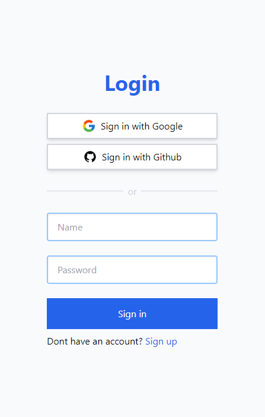
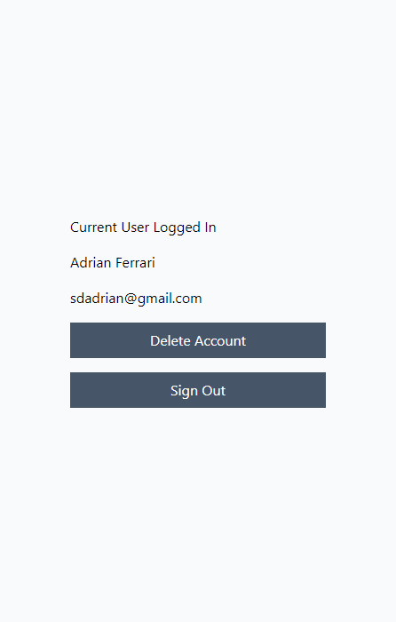

# NEXT AUTH SIGNIN

It's and App that lets you create an account with an name and password or log in with either Google or Github.

It's designed with NextJS, Next-Auth, Typescript, Tailwind and MongoDB to persist data.

## Screenshots

    
    

